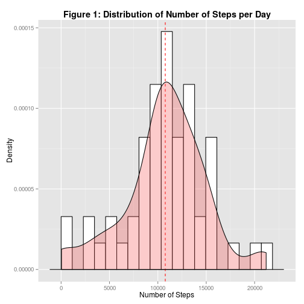
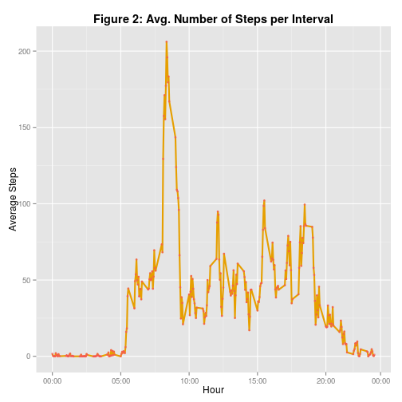
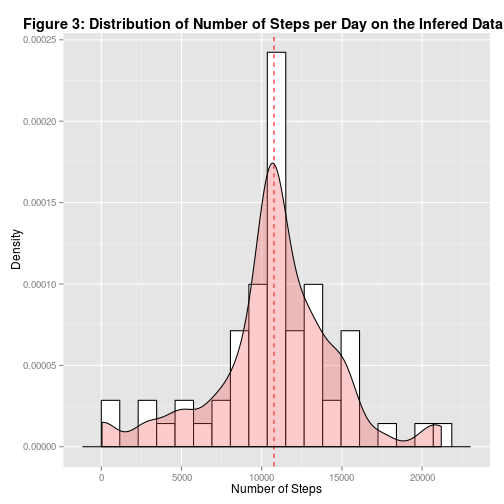
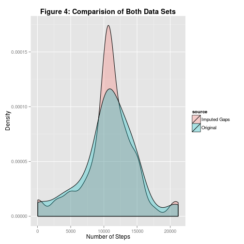
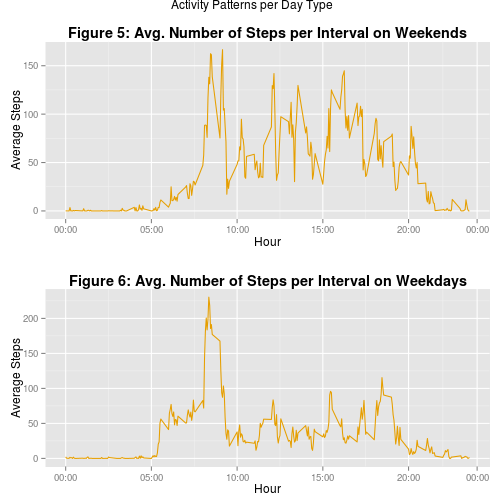
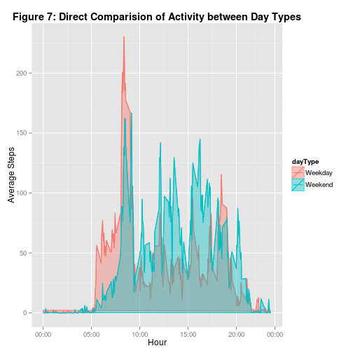

---
title: "Study on Personal Activity Monitoring Devices"
author: Pablo Doval
date: 2015-02-14
output: 
  html_document:
    keep_md: true
    theme: united
    highlight: neon
---

## Introduction

This document is the result of the implementation of the first peer assessment exercise for the *Reproducible Research* course, and focuses on the analysis of personal activity monitoring devices. It is now possible to collect a large amount of data about personal movement using activity monitoring devices such as a Fitbit, Nike Fuelband, or Jawbone Up. These type of devices are part of the "quantified self" movement -- a group of enthusiasts who take measurements about themselves regularly to improve their health, to find patterns in their behavior, or because they are tech geeks. But these data remain under-utilized both because the raw data are hard to obtain and there is a lack of statistical methods and software for processing and interpreting the data.

This assignment makes use of data from a personal activity monitoring device. This device collects data at 5 minute intervals through out the day. The data consists of two months of data from an anonymous individual collected during the months of October and November, 2012 and include the number of steps taken in 5 minute intervals each day.

### Pre-Requisites:

If the reader decides to go ahead and reproduce the analysis done on this assessments, the following pre-requisites must be met:

* The data file must be downloaded and available in R's Working Directory.
* R version is 3.1.2 (others might work, but this was developed with this specific version)
* Package ggplot2 must be installed.
* Package dplyr must be installed.
* Package gridExtra must be installed.


## Data Set: Loading and Pre-Processing the Data

The data set available for this study is a CSV file consisting on a set of 17,568 observations of the following set of parameters:

* **Steps:**   Number of steps taking in a 5-minute interval. Missing values are coded as NA.
   
* **Date:**   The date on which the measurement was taken in YYYY-MM-DD format.
   
* **Interval:**   Identifier for the 5-minute interval in which measurement was taken.
  

The data set can be downloaded from (https://d396qusza40orc.cloudfront.net/repdata%2Fdata%2Factivity.zip).

In order to load this data into R for further analysis, the **read.csv()** function will be used, performing the appropriate data type assignment on each of the columns:


```r
## Data load and column data type assignment
data <- read.csv(unzip("activity.zip"),
                 sep = ",",
                 na.strings = "NA",
                 colClasses = c("numeric","Date","numeric"))

## Summary of the data loaded
summary(data)
```

```
##      steps             date               interval     
##  Min.   :  0.00   Min.   :2012-10-01   Min.   :   0.0  
##  1st Qu.:  0.00   1st Qu.:2012-10-16   1st Qu.: 588.8  
##  Median :  0.00   Median :2012-10-31   Median :1177.5  
##  Mean   : 37.38   Mean   :2012-10-31   Mean   :1177.5  
##  3rd Qu.: 12.00   3rd Qu.:2012-11-15   3rd Qu.:1766.2  
##  Max.   :806.00   Max.   :2012-11-30   Max.   :2355.0  
##  NA's   :2304
```

```r
## Basic stats on the data set
observations <- nrow(data)
variables <- ncol(data)
```

This data set contains **17568** observations, with **3** variables each.

## What is mean total number of steps taken per day?

In this part of the study, the total number of steps taken each day during the while 2 month period will be analyzed. In order to minimize *noise* we will first remove all the observations for which there are no data at all (both NAs and 0 steps), and then depict a histogram to show the distribution of frequency for the Steps value per each day.


```r
library(ggplot2)
library(dplyr)

## Remove the NAs and get the stepsPerDate
dataNonNA <- data[complete.cases(data), ]

stepsPerDate <- dataNonNA %>%
                group_by(date) %>% 
                summarise(steps = sum(steps), mean = mean(steps), median = median(steps))

## Get the Mean and the Median
meanStepsPerDay <- round(mean(stepsPerDate$steps))
medianStepsPerDay <- median(stepsPerDate$steps)

## Plot the histogram, with a density curve and a vertical line showing the mean
ggplot(data=stepsPerDate, aes(x = steps)) + 
  geom_histogram(aes(y = ..density..), colour = "black", fill = "white", binwidth = 1150) + 
  geom_vline(aes(xintercept = mean(steps)), color = "red", linetype = "dashed", size = 0.5) +
  geom_density(alpha = .3, fill = "#F75555") + 
  xlab("Number of Steps") + 
  ylab("Density") +
  ggtitle("Figure 1: Distribution of Number of Steps per Day") +
  theme(plot.title = element_text (lineheight=.9, face="bold"))
```

 

*NOTE: The red line in previous figure represents the mean of the number of steps.*

As depicted on the *Figure 1*, the mean total number of steps per day is **10766.00**. The median is not shown on the graphic, due to the extreme close proximity to the mean, since the median of steps per day is **10765.00**.

## What is the average daily activity pattern?

This section will analyze the average daily activity pattern of the subject of the experiment, and will try to identify which 5-minute interval, on average across all the days in the data set, contains the maximum number of steps.


```r
library(ggplot2)
library(dplyr)

## New data set without NAs, and factor the interval column
dataNonNA <- data[complete.cases(data), ]
dataNonNA$interval <- as.factor(dataNonNA$interval)

## Group by Interval and Mean
activityPerInterval <- dataNonNA %>% 
                       group_by(interval) %>% 
                       summarise(meanSteps = mean(steps))

## Compute Interval of maxium steps
intervalOfMaximumSteps <- activityPerInterval[which.max(activityPerInterval$meanSteps),]

## Plot the data
ggplot(data=activityPerInterval, aes(x = as.numeric(levels(interval))[interval], 
                                     y = meanSteps, 
                                     group = 1)) + 
  geom_line(colour = "#E69F00", linetype = "solid", size = 1) + 
  geom_point(colour="#F75555", size=1.5, shape=20, fill="#EB92F7", alpha=.6) +
  scale_x_continuous(breaks = c(0, 500, 1000, 1500, 2000, 2400), 
                     labels = c("00:00", "05:00", "10:00", "15:00", "20:00", "00:00")) +
  ggtitle("Figure 2: Avg. Number of Steps per Interval") + 
  theme(plot.title = element_text (lineheight=.9, face="bold")) + 
  xlab("Hour") + 
  ylab("Average Steps")
```

 

According to this analysis, the interval on which, in average across all days, the subject of the experiment has registered more steps is interval **835**, with **206.17** steps on average.


## Imputing missing values

This data set shows a considerable number of missing values, which is quite understandable on type of data sets; the device might ran out of battery, or the subject of the experiment might have opted not to wear it - or simply forgot to do it - on particular ocassions.

Let's investigate a little bit more on the quality of our data set:


```r
## Count total and missing values 
missing <- data[which(is.na(data)),]

countMissing <- nrow(missing)
totalRows <- nrow(data)
```

A quick analysis with the previous R code reveals that **2304** rows (out of a total of *17568* rows) contain missing values.

In order to be able to better understand the patterns of activy of the subject of the experiment in the next steps, we will try to improve the quality of the data set by filling these activity gaps with some imputed values; in this case we are simply going to use the average values computed for the previous exercise.


```r
## Count total and missing values 
imputedDataSet <- data

for(row in 1:nrow(imputedDataSet))
{
   if(is.na(imputedDataSet[row,]$steps))
   {
      interval <- imputedDataSet[row,]$interval  
      imputedDataSet[row,]$steps <- activityPerInterval[which(activityPerInterval$interval == interval),]$meanSteps
   }        
}

oldRowCount <- nrow(dataNonNA)
newRowCount <- nrow(imputedDataSet)
```

By using the means generated previously, we are able to *guess* the missing values, and hence the total number of rows of our new imputed data set is back to 17568, from the previous 15264 that the data set with NAs removed had.

Now that we have created a new data set with not gaps, let's see the histogram:


```r
library(ggplot2)
library(dplyr)

## Compute the steps per date on the new data set
stepsPerDateImputedDataSet <- imputedDataSet %>%
                              group_by(date) %>% 
                              summarise(steps = sum(steps), mean = mean(steps), median = median(steps))

## Get the Mean and the Median
meanStepsPerDayImputedDataSet <- mean(stepsPerDateImputedDataSet$steps)
medianStepsPerDayImputedDataSet <- median(stepsPerDateImputedDataSet$steps)

## Plot the histogram, with a density curve and a vertical line showing the mean
ggplot(data = stepsPerDateImputedDataSet, aes(x = steps)) + 
  geom_histogram(aes(y = ..density..), colour = "black", fill = "white", binwidth = 1150) + 
  geom_vline(aes(xintercept = mean(steps)), color = "red", linetype = "dashed", size = 0.5) +
  geom_density(alpha = .3, fill = "#F75555") + 
  xlab("Number of Steps") + 
  ylab("Density") +
  ggtitle("Figure 3: Distribution of Number of Steps per Day on the Infered Data Set") +
  theme(plot.title = element_text (lineheight=.9, face="bold"))
```

 

It is quite obvious the the histogram difers slightly from the previously computed with the original data set with gaps. The new data set's mean for the total number of steps per day is **10766.19**, while the median is **10766.19**.

Now let's compare both histograms by their density area:


```r
library(ggplot2)
library(dplyr)

## Generate a new data set with both data frame's data on in...
combinedData1 <- mutate(stepsPerDate, source = "Original")
combinedData2 <- mutate(stepsPerDateImputedDataSet, source = "Imputed Gaps")
combinedData <- rbind(combinedData1, combinedData2)

## Plot the histogram, with a density curve and a vertical line showing the mean
ggplot(data=combinedData, aes(x = steps, fill = source)) + 
  geom_density(alpha = .3) + 
  xlab("Number of Steps") + 
  ylab("Density") +
  ggtitle("Figure 4: Comparision of Both Data Sets") +
  theme(plot.title = element_text (lineheight=.9, face="bold"))
```

 

The comparision of both density graphs show quite clearly that the filling of the gaps has a slight effect on the skewness towards the center of distribution of the data, but the distribution is similar.

## Are there differences in activity patterns between weekdays and weekends?

One obvious question that we can ask from this data set is whether there are different activity patterns between weekdays and weekends on the subject of the study; the analysis here will be quite similar to the analysis done previously, but adding a new factor column that will indicate wheter the day lies on a weekday or weekend.


```r
library(ggplot2)
library(gridExtra)
library(dplyr)

## Set up locale to English
Sys.setlocale("LC_TIME", "C")
```

```
## [1] "C"
```

```r
## Get the data  set and factor the day type and the interval
dataPerDayType <- mutate(imputedDataSet, 
                         dayType = ifelse
                         (
                           weekdays(imputedDataSet$date) == "Sunday" |  weekdays(imputedDataSet$date) == "Saturday", 
                           "Weekend", 
                           "Weekday"
                         ))
dataPerDayType$dayType <- as.factor(dataPerDayType$dayType)
dataPerDayType$interval <- as.factor(dataPerDayType$interval)

## Now we group and summarize the data as we did before, in two 
## groups: weekend and weekday

weekend <- dataPerDayType %>% 
        filter(dayType == "Weekend") %>%
        group_by(interval) %>% 
        summarise (meanSteps = mean(steps))


weekday <- dataPerDayType %>% 
        filter(dayType == "Weekday") %>%
        group_by(interval) %>% 
        summarise (meanSteps = mean(steps))

gfx1 <- ggplot(data = weekend, aes(x = as.numeric(levels(interval))[interval], y = meanSteps, group = 1)) + 
  geom_line(colour = "#E69F00") + 
  scale_x_continuous(breaks = c(0,500,1000, 1500, 2000, 2400), 
                     labels = c("00:00", "05:00", "10:00", "15:00", "20:00", "00:00")) +
  ggtitle("Figure 5: Avg. Number of Steps per Interval on Weekends") + 
  theme(plot.title = element_text(lineheight = .8, face = "bold")) +
  xlab("Hour") + 
  ylab("Average Steps")

gfx2 <- ggplot(data = weekday, aes(x = as.numeric(levels(interval))[interval], y = meanSteps, group = 1)) + 
  geom_line(colour = "#E69F00") + 
  scale_x_continuous(breaks = c(0,500,1000, 1500, 2000, 2400), 
                     labels = c("00:00", "05:00", "10:00", "15:00", "20:00", "00:00")) +
  ggtitle("Figure 6: Avg. Number of Steps per Interval on Weekdays") + 
  theme(plot.title = element_text(lineheight = .8, face = "bold")) +
  xlab("Hour") + 
  ylab("Average Steps")

## Arrange both graphs on the same grid
grid.arrange(gfx1, gfx2, nrow = 2, main = "Activity Patterns per Day Type")
```

 

Analyzing both plots we can deduce that the peak of activity is higher on weekends, but let's plot both of them on the same graph so we can compare them better:


```r
library(ggplot2)
library(gridExtra)
library(dplyr)

## First, let's combine both datasets
allDays <- dataPerDayType %>% 
           group_by(interval, dayType) %>% 
           summarise (meanSteps = mean(steps))

## Now lets plot it
ggplot(data = allDays, 
       aes(x = as.numeric(levels(interval))[interval], 
           y = meanSteps, 
           group = dayType, 
           colour = dayType, 
           fill = dayType)) + 
  geom_line() + 
  scale_x_continuous(breaks = c(0,500,1000, 1500, 2000, 2400), 
                     labels = c("00:00", "05:00", "10:00", "15:00", "20:00", "00:00")) +
  geom_polygon(data = allDays, aes(as.numeric(levels(interval))[interval], meanSteps), alpha = 0.4) +
  ggtitle("Figure 7: Direct Comparision of Activity between Day Types") + 
  theme(plot.title = element_text(lineheight = .8, face = "bold")) +
  xlab("Hour") + 
  ylab("Average Steps")
```

 

This last graph shows quite clearly that, while the activity peaks at sometime around 08:30 AM on weekdays, the rest of the day is more inactive; probably due to the fact that this subject's job do not require plenty of physical activity. On the other hand, weekends show an increased activity on average beteen all hours, but with a much slower start of the day.
